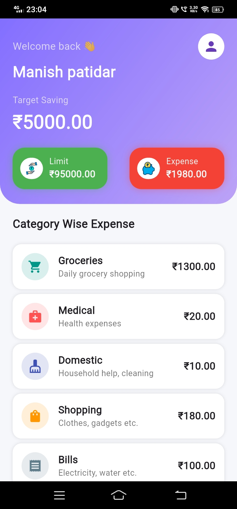
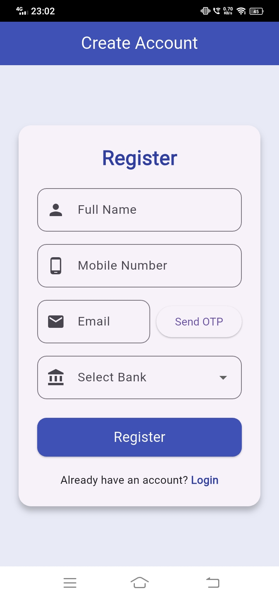
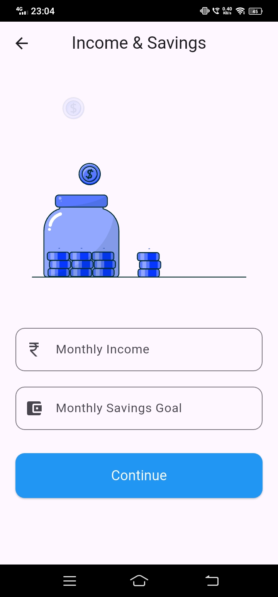
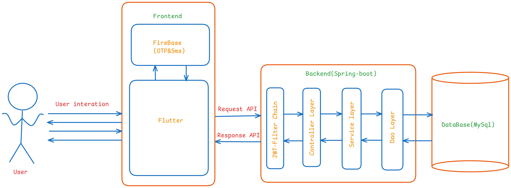
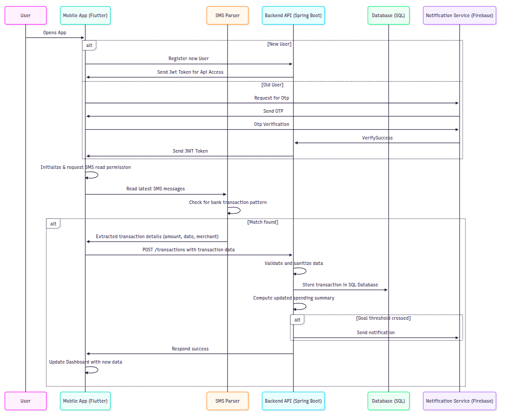

# Tijori

Tijori is a cross-platform expense tracker application featuring a Flutter-based frontend and a Java Spring Boot backend. The project is organized into two main components:

- **Frontend**: A Flutter app supporting Android as well as iOS.
- **Backend**: A Spring Boot application providing RESTful APIs for expense management.

---


## Screenshots

,





  
---

## System Architecture

The following diagram illustrates the high-level architecture of Tijori:



- **User**: Interacts with the application through the Flutter-based frontend.
- **Frontend**: Built with Flutter, it communicates with Firebase for OTP and SMS authentication, and interacts with the backend via REST APIs.
- **Backend (Spring Boot)**: Handles authentication (via JWT filter chain), business logic (service layer), API endpoints (controller layer), and data access (DAO layer).
- **Database (MySQL)**: Stores user and expense data, accessed by the backend.
---

## Sequence Diagram

Below is a typical sequence of operations for adding a new expense:



1. User opens the Flutter app.
2. The app reads the latest SMS messages.
3. The SMS Parser checks for bank transaction patterns in the messages.
4. If a transaction is found, the app extracts transaction details (amount, date, merchant).
5. The app sends a POST request with transaction data to the backend API.
6. The backend validates and sanitizes the data, then stores the transaction in the SQL database.
7. The backend computes the updated spending summary.
8. If a spending goal threshold is crossed, a notification is sent via Firebase.
9. The app updates the dashboard with the new data.

---

## Project Structure

```
Tijori/
│
├── Backend/      # Java Spring Boot backend
│   ├── src/
│   ├── pom.xml
│   ├── Dockerfile
│   └── ...
│
└── Frontend/     # Flutter frontend
    ├── lib/
    ├── pubspec.yaml
    ├── android/
    ├── ios/
    ├── web/
    ├── windows/
    ├── macos/
    ├── linux/
    └── ...
```

---

## Features

- Track and manage expenses.
- Data visualization with charts (`fl_chart`).
- Modern UI with Lottie animations.
- Preferences and settings with `shared_preferences`.
- REST API integration with the backend.

---

## Getting Started

### Prerequisites

- [Flutter SDK](https://flutter.dev/docs/get-started/install)
- [Java 21+](https://www.oracle.com/java/technologies/downloads/#java21) (for backend)
- [Maven](https://maven.apache.org/) (for backend)
- [Docker](https://www.docker.com/) (optional, for containerized backend)

### Backend Setup

1. Navigate to the `Backend` directory:
    ```sh
    cd Backend
    ```
2. Copy `.env.example` to `.env` and configure environment variables as needed.
3. Build and run the backend:
    ```sh
    ./mvnw spring-boot:run
    ```
   Or with Docker:
    ```sh
    docker build -t tijori-backend .
    docker run --env-file .env -p 8080:8080 tijori-backend
    ```

### Frontend Setup

1. Navigate to the `Frontend` directory:
    ```sh
    cd Frontend
    ```
2. Install dependencies:
    ```sh
    flutter pub get
    ```
3. Run the app on your desired platform:
    ```sh
    flutter run
    ```

---

## Configuration

- **Backend**: Configure database and API settings in `Backend/.env`.
- **Frontend**: Update API endpoints in the Flutter code as needed.

---

## Dependencies

### Frontend

- `flutter_secure_storage`
- `shared_preferences`
- `http`
- `intl`
- `lottie`
- `fl_chart`
- `cupertino_icons`
- `another_telephony`
- `permission_handler`

See [`Frontend/pubspec.yaml`](Frontend/pubspec.yaml) for the full list.

### Backend

- Java 21+
- Spring Boot
- Maven

See [`Backend/pom.xml`](Backend/pom.xml) for details.

---

## Contributing

Pull requests are welcome. For major changes, please open an issue first to discuss what you would like to change.

---
